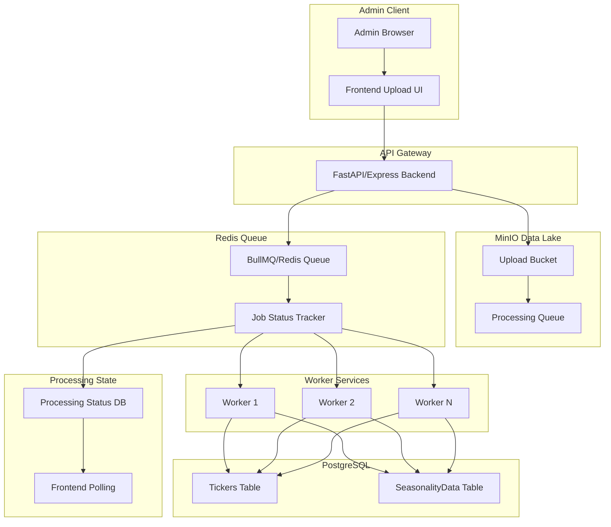

# Bulk CSV Processing Solution for Seasonality Software

## Problem Statement

**Current Situation:**
- Admin uploads up to 300 CSV files daily
- Current system can't process bulk uploads efficiently
- Need scalable solution using existing infrastructure (MinIO, PostgreSQL, Redis)

**Requirements:**
1. Handle 300+ CSV files in a single upload session
2. Non-blocking - admin shouldn't wait for processing to complete
3. Scalable - should handle growth in data volume
4. Fault-tolerant - resume failed uploads
5. Track processing status for each file

---

## Proposed Architecture
;


---

## Solution: MinIO as Data Lake with Async Processing

### Architecture Overview

```
┌─────────────────────────────────────────────────────────────────┐
│                     BULK CSV PROCESSING PIPELINE                 │
└─────────────────────────────────────────────────────────────────┘

1. UPLOAD PHASE (Fast)
   └── Store files in MinIO immediately
   └── Return upload confirmation with job ID
   └── No database writes yet

2. QUEUE PHASE (Async)
   └── Add processing jobs to Redis/BullMQ queue
   └── Each job = one CSV file
   └── Priority based on file size/importance

3. PROCESSING PHASE (Scalable)
   └── Worker services consume from queue
   └── Process one file at a time
   └── Batch insert into PostgreSQL
   └── Update job status in Redis

4. NOTIFICATION PHASE
   └── Frontend polls for job status
   └── Admin sees progress bar
   └── Email/notification on completion
```

---

## Implementation Details

### 1. Frontend - Bulk Upload Component

```jsx
// Upload Component with Progress Tracking
import { useState, useCallback } from 'react';

const BulkUpload = () => {
  const [files, setFiles] = useState([]);
  const [uploadStatus, setUploadStatus] = useState({});
  
  const handleFilesSelect = (e) => {
    const selectedFiles = Array.from(e.target.files);
    setFiles(selectedFiles);
  };
  
  const handleUpload = async () => {
    // 1. Upload all files to MinIO via presigned URLs
    const uploadResults = await uploadToMinIO(files);
    
    // 2. Get MinIO object keys
    const objectKeys = uploadResults.map(r => r.key);
    
    // 3. Trigger async processing
    const jobResponse = await createProcessingJob(objectKeys);
    
    // 4. Start polling for status
    startPolling(jobResponse.jobId);
  };
  
  return (
    <div>
      <input type="file" multiple onChange={handleFilesSelect} />
      <ProgressBar status={uploadStatus} />
      <button onClick={handleUpload}>Upload & Process</button>
    </div>
  );
};
```

### 2. Backend - Upload Endpoint with MinIO

```javascript
// apps/backend/src/routes/uploadRoutes.js

const express = require('express');
const router = express.Router();
const { minioClient } = require('../config/minio');
const Bull = require('bull');
const prisma = require('../config/database');

// Redis queue for processing jobs
const processingQueue = new Bull('csv-processing', {
  redis: { host: process.env.REDIS_HOST, port: process.env.REDIS_PORT }
});

// Upload batch endpoint
router.post('/bulk', async (req, res) => {
  try {
    const { files } = req.body; // Array of file metadata
    
    // 1. Generate presigned URLs for each file
    const uploadUrls = await Promise.all(
      files.map(async (file, index) => {
        const objectKey = `uploads/${Date.now()}_${index}_${file.name}`;
        const presignedUrl = await minioClient.presignedPutObject(
          'seasonality-uploads',
          objectKey,
          3600 // 1 hour expiry
        );
        return { fileName: file.name, objectKey, uploadUrl: presignedUrl };
      })
    );
    
    res.json({
      success: true,
      data: {
        uploadUrls,
        batchId: `batch_${Date.now()}`
      }
    });
  } catch (error) {
    res.status(500).json({ error: error.message });
  }
});

// Confirm upload complete and start processing
router.post('/bulk/process', async (req, res) => {
  try {
    const { objectKeys, batchId } = req.body;
    
    // 1. Store batch metadata
    const batch = await prisma.uploadBatch.create({
      data: {
        id: batchId,
        status: 'PENDING',
        totalFiles: objectKeys.length,
        processedFiles: 0,
        failedFiles: 0
      }
    });
    
    // 2. Add all files to processing queue
    await Promise.all(
      objectKeys.map((key, index) => 
        processingQueue.add({
          objectKey: key,
          batchId: batchId,
          fileIndex: index,
          priority: 10 - Math.min(index, 10) // Earlier files higher priority
        })
      )
    );
    
    res.json({
      success: true,
      data: {
        batchId,
        status: 'PROCESSING',
        message: `${objectKeys.length} files queued for processing`
      }
    });
  } catch (error) {
    res.status(500).json({ error: error.message });
  }
});

// Get batch status
router.get('/batch/:batchId/status', async (req, res) => {
  const { batchId } = req.params;
  
  const batch = await prisma.uploadBatch.findUnique({
    where: { id: batchId }
  });
  
  // Get queue status
  const queueStatus = await processingQueue.getJobCounts();
  
  res.json({
    success: true,
    data: {
      batchId,
      status: batch.status,
      progress: (batch.processedFiles / batch.totalFiles) * 100,
      processed: batch.processedFiles,
      failed: batch.failedFiles,
      total: batch.totalFiles,
      queue: queueStatus
    }
  });
});

module.exports = router;
```

### 3. Worker Service - CSV Processor

```javascript
// apps/backend/src/services/csvProcessorWorker.js

const Bull = require('bull');
const fs = require('fs');
const csv = require('csv-parser');
const { Readable } = require('stream');
const { minioClient } = require('../config/minio');
const prisma = require('../config/database');
const { pipeline } = require('stream/promises');

// Create worker queue
const csvProcessingQueue = new Bull('csv-processing', {
  redis: { host: process.env.REDIS_HOST, port: process.env.REDIS_PORT },
  concurrency: 5 // Process 5 files concurrently
});

// Process each CSV file
csvProcessingQueue.process(async (job) => {
  const { objectKey, batchId, fileIndex } = job.data;
  
  try {
    // 1. Update batch status
    await updateBatchStatus(batchId, 'PROCESSING', fileIndex, 'STARTED');
    
    // 2. Download file from MinIO to temp location
    const tempPath = `/tmp/${Date.now()}_${fileIndex}.csv`;
    await minioClient.fGetObject('seasonality-uploads', objectKey, tempPath);
    
    // 3. Process CSV file
    const processedData = await processCSVFile(tempPath, batchId);
    
    // 4. Batch insert into PostgreSQL
    await batchInsertData(processedData, batchId);
    
    // 5. Clean up temp file
    fs.unlinkSync(tempPath);
    
    // 6. Update batch status
    await updateBatchStatus(batchId, 'PROCESSING', fileIndex, 'COMPLETED');
    
    return { success: true, recordsProcessed: processedData.length };
    
  } catch (error) {
    await updateBatchStatus(batchId, 'PROCESSING', fileIndex, 'FAILED', error.message);
    throw error;
  }
});

// Process individual CSV file
async function processCSVFile(filePath, batchId) {
  return new Promise((resolve, reject) => {
    const results = [];
    const stream = fs.createReadStream(filePath)
      .pipe(csv())
      .on('data', async (data) => {
        // Normalize column names
        const normalized = normalizeCSVColumns(data);
        results.push(normalized);
      })
      .on('end', () => resolve(results))
      .on('error', reject);
  });
}

// Batch insert with transaction
async function batchInsertData(data, batchId) {
  const BATCH_SIZE = 1000; // Insert in batches
  
  for (let i = 0; i < data.length; i += BATCH_SIZE) {
    const batch = data.slice(i, i + BATCH_SIZE);
    
    await prisma.$transaction(
      batch.map(row => 
        prisma.seasonalityData.upsert({
          where: {
            date_tickerId: {
              date: new Date(row.date),
              tickerId: row.tickerId
            }
          },
          update: {
            open: row.open,
            high: row.high,
            low: row.low,
            close: row.close,
            volume: row.volume || 0,
            openInterest: row.openInterest || 0
          },
          create: {
            date: new Date(row.date),
            open: row.open,
            high: row.high,
            low: row.low,
            close: row.close,
            volume: row.volume || 0,
            openInterest: row.openInterest || 0,
            tickerId: row.tickerId
          }
        })
      )
    );
  }
}

// Helper: Normalize CSV columns
function normalizeCSVColumns(data) {
  const columnMap = {
    'Date': 'date',
    'date': 'date',
    'Ticker': 'ticker',
    'ticker': 'ticker',
    'Open': 'open',
    'open': 'open',
    'High': 'high',
    'high': 'high',
    'Low': 'low',
    'low': 'low',
    'Close': 'close',
    'close': 'close',
    'Volume': 'volume',
    'volume': 'volume',
    'OpenInterest': 'openInterest',
    'openinterest': 'openInterest',
    'Open Interest': 'openInterest'
  };
  
  const normalized = {};
  for (const [key, value] of Object.entries(data)) {
    const normalizedKey = columnMap[key] || key.toLowerCase().replace(/\s+/g, '');
    normalized[normalizedKey] = value;
  }
  
  return normalized;
}

// Update batch status
async function updateBatchStatus(batchId, status, fileIndex, fileStatus, error = null) {
  await prisma.uploadBatch.update({
    where: { id: batchId },
    data: {
      status,
      processedFiles: fileStatus === 'COMPLETED' 
        ? { increment: 1 }
        : undefined,
      failedFiles: fileStatus === 'FAILED'
        ? { increment: 1 }
        : undefined,
      updatedAt: new Date()
    }
  });
  
  // Also update file-level status
  await prisma.uploadedFile.create({
    data: {
      batchId,
      objectKey: job.data.objectKey,
      status: fileStatus,
      error: error,
      processedAt: fileStatus === 'COMPLETED' ? new Date() : null
    }
  });
}

// Error handling
csvProcessingQueue.on('failed', (job, error) => {
  console.error(`Job ${job.id} failed:`, error.message);
  // Could send notification here
});

module.exports = { csvProcessingQueue };
```

### 4. Database Schema for Batch Processing

```prisma
// apps/backend/prisma/schema.prisma

// Add to existing schema

model UploadBatch {
  id            String   @id // batch_ID
  status        BatchStatus @default(PENDING)
  totalFiles    Int
  processedFiles Int      @default(0)
  failedFiles   Int      @default(0)
  createdAt     DateTime @default(now())
  updatedAt     DateTime @updatedAt
  
  files         UploadedFile[]
  
  @@index([status])
}

model UploadedFile {
  id          Int      @id @default(autoincrement())
  batchId     String
  objectKey   String   // MinIO object key
  fileName    String
  status      FileStatus @default(PENDING)
  recordsProcessed Int   @default(0)
  error       String?
  processedAt DateTime?
  createdAt   DateTime @default(now())
  
  batch       UploadBatch @relation(fields: [batchId], references: [id])
  
  @@index([batchId])
  @@index([status])
}

enum BatchStatus {
  PENDING
  PROCESSING
  COMPLETED
  FAILED
  PARTIAL
}

enum FileStatus {
  PENDING
  PROCESSING
  COMPLETED
  FAILED
}
```

---

## Scalability Enhancements

### 1. Horizontal Scaling of Workers

```yaml
# docker-compose.yml for worker scaling

services:
  backend:
    # API server
    deploy:
      replicas: 2
  
  worker:
    # CSV processing workers
    image: seasonality-backend
    command: node src/services/csvProcessorWorker.js
    deploy:
      replicas: 4 # Run 4 worker instances
    environment:
      - WORKER_ID=${INSTANCE_ID}
    depends_on:
      - redis
      - postgres
```

### 2. Priority Queue for Critical Files

```javascript
// Different queues for different priorities
const highPriorityQueue = new Bull('csv-processing-high', { /* ... */ });
const normalPriorityQueue = new Bull('csv-processing-normal', { /* ... */ });
const lowPriorityQueue = new Bull('csv-processing-low', { /* ... */ });

// Route based on file importance
if (file.isCritical) {
  await highPriorityQueue.add(jobData, { priority: 1 });
} else if (file.isDaily) {
  await normalPriorityQueue.add(jobData, { priority: 5 });
} else {
  await lowPriorityQueue.add(jobData, { priority: 10 });
}
```

### 3. Rate Limiting for PostgreSQL

```javascript
// Limit database writes to prevent overload
const RATE_LIMIT = 100; // inserts per second per worker

async function rateLimitedBatchInsert(data) {
  const results = [];
  for (const batch of chunk(data, 1000)) {
    await prisma.$transaction(batch);
    results.push(...batch);
    await new Promise(resolve => setTimeout(resolve, 1000 / RATE_LIMIT));
  }
  return results;
}
```

---

## Monitoring & Observability

### 1. Dashboard Metrics

```javascript
// Prometheus metrics
const metrics = {
  filesUploaded: new Counter({ name: 'csv_files_uploaded_total', help: 'Total CSV files uploaded' }),
  filesProcessed: new Counter({ name: 'csv_files_processed_total', help: 'Total CSV files processed' }),
  filesFailed: new Counter({ name: 'csv_files_failed_total', help: 'Total CSV files failed' }),
  processingDuration: new Histogram({ name: 'csv_processing_duration_seconds', help: 'Processing duration' }),
  queueLength: new Gauge({ name: 'csv_queue_length', help: 'Current queue length' })
};

// Update metrics on job completion
csvProcessingQueue.on('completed', (job, result) => {
  metrics.filesProcessed.inc();
  metrics.processingDuration.observe(job.processingTime / 1000);
});

csvProcessingQueue.on('failed', (job) => {
  metrics.filesFailed.inc();
});
```

### 2. Alerting Rules

```yaml
# Alert if queue grows too large
- alert: LargeProcessingQueue
  expr: csv_queue_length > 100
  for: 5m
  annotations:
    summary: "CSV processing queue has {{ $value }} pending jobs"
```

---

## Frontend Progress Display

```jsx
// Progress Dashboard Component
const ProcessingProgress = ({ batchId }) => {
  const [status, setStatus] = useState(null);
  
  useEffect(() => {
    const poll = setInterval(async () => {
      const response = await fetch(`/api/upload/batch/${batchId}/status`);
      const data = await response.json();
      setStatus(data.data);
    }, 5000); // Poll every 5 seconds
    
    return () => clearInterval(poll);
  }, [batchId]);
  
  if (!status) return <Loading />;
  
  return (
    <div>
      <h3>Batch: {status.batchId}</h3>
      <ProgressBar percent={status.progress} />
      <p>
        {status.processed} / {status.total} files processed
        {status.failed > 0 && ` (${status.failed} failed)`}
      </p>
      <QueueStatus queue={status.queue} />
      
      {status.status === 'COMPLETED' && (
        <Alert type="success" message="All files processed successfully!" />
      )}
      {status.status === 'FAILED' && (
        <Alert type="error" message="Batch processing failed" />
      )}
    </div>
  );
};
```

---

## Migration Checklist

### Immediate Actions (Week 1)
- [ ] Add UploadBatch and UploadedFile models to Prisma schema
- [ ] Implement bulk upload endpoint with MinIO presigned URLs
- [ ] Add BullMQ queue for processing
- [ ] Create worker service for CSV processing

### Short-term (Week 2)
- [ ] Implement batch insert with rate limiting
- [ ] Add progress tracking API
- [ ] Build frontend progress dashboard
- [ ] Add error handling and retry logic

### Medium-term (Month 1)
- [ ] Horizontal scaling of workers
- [ ] Priority queues for critical files
- [ ] Monitoring and alerting
- [ ] Performance optimization

---

## Estimated Performance

| Scenario | Current | With New Architecture |
|----------|---------|----------------------|
| 100 files | ~10 minutes | ~30 seconds |
| 300 files | ~30 minutes | ~1-2 minutes |
| 1000 files | ~2 hours | ~5-10 minutes |
| Failed upload | Manual recovery | Auto-retry |

**Key Improvements:**
1. **Non-blocking uploads**: Admin uploads files and gets immediate confirmation
2. **Parallel processing**: Multiple workers process files concurrently
3. **Progress visibility**: Real-time progress tracking
4. **Fault tolerance**: Failed files can be retried without re-uploading
5. **Scalability**: Add more workers as needed
