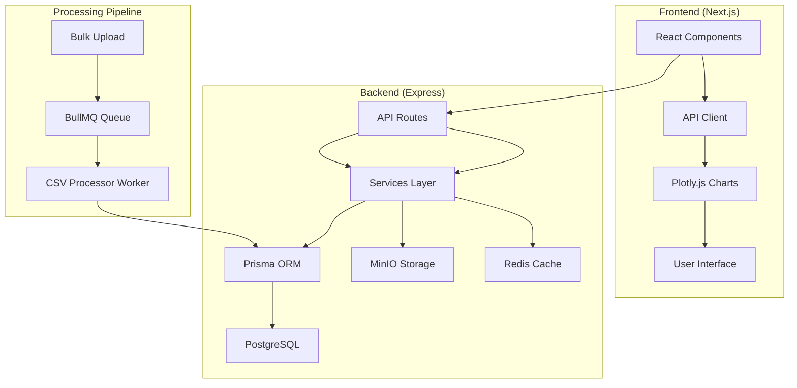

# Seasonality Software Implementation Plan

## Current State Analysis

### Completed Components
1. **Backend Infrastructure**: Express server with basic routes
2. **Database Schema**: Prisma models for Ticker and SeasonalityData
3. **File Upload System**: Bulk upload with MinIO integration
4. **Background Processing**: BullMQ queue for async CSV processing
5. **Frontend Components**: BulkUpload component with real-time status

### Missing Components
1. **Data Processing Logic**: Python pandas operations need Node.js implementation
2. **Visualization Layer**: Plotly.js charts for all analysis types
3. **Frontend UI**: 11 tab components with filters and controls
4. **API Endpoints**: Most data analysis endpoints not implemented
5. **Authentication**: JWT system needs integration

## Implementation Roadmap

### Phase 1: Database Enhancement (Week 1)
- [ ] Add computed columns to SeasonalityData model
- [ ] Create migration scripts for existing data
- [ ] Implement data validation and integrity checks
- [ ] Set up database indexes for performance

### Phase 2: Backend Services (Weeks 2-3)
- [ ] Implement dataService.js with filtering logic
- [ ] Build calculationService.js for return calculations
- [ ] Create aggregationService.js for data aggregation
- [ ] Develop filterService.js for multi-level filtering
- [ ] Implement all 12 API endpoints as specified

### Phase 3: Frontend Foundation (Week 4)
- [ ] Set up Next.js project structure
- [ ] Create shared UI components (filters, inputs)
- [ ] Implement API client library
- [ ] Build layout and navigation system

### Phase 4: Visualization Components (Week 5)
- [ ] Create CandlestickChart component
- [ ] Build OverlayChart component
- [ ] Implement AggregateChart component
- [ ] Develop SuperimposedChart component
- [ ] Add Heatmap component for correlations

### Phase 5: Tab Implementation (Weeks 6-8)
- [ ] DailyTab with all filters and charts
- [ ] WeeklyTab with weekly-specific calculations
- [ ] MonthlyTab with monthly analysis
- [ ] YearlyTab with yearly trends
- [ ] ScenarioTab for backtesting
- [ ] ElectionTab for political analysis
- [ ] ScannerTab for symbol scanning
- [ ] BacktesterTab for phenomena testing
- [ ] PhenomenaTab for pattern detection
- [ ] BasketTab for portfolio analysis
- [ ] ChartsTab for animated visualizations

### Phase 6: Integration & Testing (Week 9)
- [ ] Connect frontend to backend APIs
- [ ] Implement real-time data updates
- [ ] Set up comprehensive error handling
- [ ] Create unit and integration tests
- [ ] Perform user acceptance testing

### Phase 7: Deployment (Week 10)
- [ ] Configure production Docker setup
- [ ] Set up monitoring and logging
- [ ] Implement backup procedures
- [ ] Create deployment documentation
- [ ] Execute zero-downtime deployment

## Technical Architecture



## Key Implementation Details

### Database Schema Enhancements
```prisma
model SeasonalityData {
    // Existing fields
    id            Int      @id @default(autoincrement())
    date          DateTime
    open          Float
    high          Float
    low           Float
    close         Float
    volume        Float
    openInterest  Float
    tickerId      Int
    ticker        Ticker   @relation(fields: [tickerId], references: [id])
    
    // New computed fields
    ReturnPercentage          Float?
    MondayWeeklyReturnPercentage Float?
    ExpiryWeeklyReturnPercentage Float?
    MonthlyReturnPercentage   Float?
    YearlyReturnPercentage    Float?
    
    // Date components
    Weekday           String?
    WeekNumber        Int?
    MonthNumber       Int?
    Year              Int?
    
    // Classification fields
    PositiveDay       Boolean?
    PositiveWeek      Boolean?
    PositiveMonth     Boolean?
    PositiveYear      Boolean?
    EvenDay           Boolean?
    EvenWeek          Boolean?
    EvenMonth         Boolean?
    EvenYear          Boolean?
    
    @@unique([date, tickerId])
}
```

### API Endpoints Implementation

| Endpoint | Method | Service | Description |
|----------|--------|---------|-------------|
| `/api/data/tickers` | GET | dataService | Get all available tickers |
| `/api/data/ticker/:id` | GET | dataService | Get data for specific ticker |
| `/api/data/daily` | GET | dataService | Daily time frame data |
| `/api/data/weekly` | GET | dataService | Weekly time frame data |
| `/api/data/monthly` | GET | dataService | Monthly time frame data |
| `/api/data/yearly` | GET | dataService | Yearly time frame data |
| `/api/data/scenario` | POST | scenarioService | Scenario analysis |
| `/api/data/scanner` | GET | scannerService | Symbol scanner |
| `/api/data/phenomena` | POST | phenomenaService | Phenomena backtesting |
| `/api/data/elections` | GET | electionService | Election analysis |
| `/api/data/basket` | POST | basketService | Basket analysis |

### Frontend Component Structure

```
apps/frontend/src/
├── app/
│   ├── page.js                    # Main dashboard
│   ├── layout.js                  # App layout
│   └── globals.css               # Global styles
├── components/
│   ├── charts/
│   │   ├── CandlestickChart.js
│   │   ├── OverlayChart.js
│   │   ├── AggregateChart.js
│   │   └── SuperimposedChart.js
│   ├── filters/
│   │   ├── SymbolSelector.js
│   │   ├── DateRangePicker.js
│   │   ├── YearFilter.js
│   │   ├── MonthFilter.js
│   │   ├── WeekFilter.js
│   │   └── DayFilter.js
│   ├── dataTables/
│   │   ├── StatisticsTable.js
│   │   ├── ReturnsTable.js
│   │   └── PhenomenaTable.js
│   └── tabs/
│       ├── DailyTab.js
│       ├── WeeklyTab.js
│       ├── MonthlyTab.js
│       ├── YearlyTab.js
│       ├── ScenarioTab.js
│       ├── ElectionTab.js
│       ├── ScannerTab.js
│       ├── BacktesterTab.js
│       ├── PhenomenaTab.js
│       ├── BasketTab.js
│       └── ChartsTab.js
└── lib/
    ├── api.js                    # API client
    ├── utils.js                  # Utility functions
    └── constants.js              # Constants
```

## Migration Strategy

### Data Migration Process
1. **Extract**: Read CSV files from old `Symbols/` directory
2. **Transform**: Convert to database format with calculations
3. **Load**: Insert into PostgreSQL using batch processing
4. **Validate**: Verify data integrity and completeness

### Feature Parity Checklist
- [ ] All 11 tabs implemented with equivalent functionality
- [ ] All filters and controls working as expected
- [ ] Visualizations matching or exceeding old system
- [ ] Performance optimized for large datasets
- [ ] User authentication and authorization

## Risk Assessment

### High Risk Items
1. **Data Migration**: Large CSV files may cause memory issues
2. **Performance**: Real-time calculations on large datasets
3. **User Experience**: Ensuring smooth transition from old UI

### Mitigation Strategies
1. **Batch Processing**: Process data in manageable chunks
2. **Caching**: Implement Redis caching for frequent queries
3. **Progressive Loading**: Load data incrementally in UI

## Success Criteria

1. **Functional**: All old features available in new system
2. **Performance**: API response time < 500ms for 95% of requests
3. **User Experience**: Frontend load time < 2 seconds
4. **Quality**: 100% test coverage on critical paths
5. **Deployment**: Successful zero-downtime deployment

## Timeline

- **Week 1**: Database enhancement and migration
- **Weeks 2-3**: Backend services implementation
- **Week 4**: Frontend foundation
- **Week 5**: Visualization components
- **Weeks 6-8**: Tab implementation
- **Week 9**: Integration and testing
- **Week 10**: Deployment and go-live

## Next Steps

1. Begin with database schema enhancements
2. Implement core data processing services
3. Build foundational frontend components
4. Progressively implement each tab with full functionality