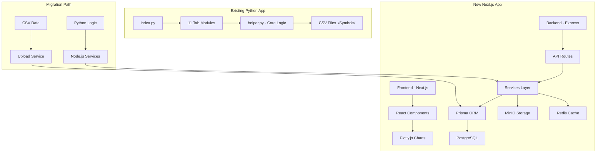

# Seasonality Software Migration Plan

## Executive Summary

This document outlines the migration strategy from the existing **Python Dash Plotly** application to a modern **Next.js/Express/PostgreSQL** full-stack application.

---

## Project Overview

### Existing Application (Python Dash Plotly)

**Technology Stack:**
- **Backend**: Python with Dash framework
- **Visualization**: Plotly.js (via Python bindings)
- **UI Components**: Dash Bootstrap Components
- **Data Storage**: CSV files in `./Symbols/` directory
- **Authentication**: Session-based persistence

**Core Features:**
1. **11 Tab-based Views**:
   - Daily TimeFrame
   - Weekly TimeFrame
   - Monthly TimeFrame
   - Yearly TimeFrame
   - Scenario Analysis
   - Elections Analysis
   - Symbol Scanner
   - Phenomena Backtester
   - Phenomena Analysis
   - Basket Analysis
   - Animated Charts

2. **Data Processing**:
   - CSV file parsing from local directory
   - Multi-level filtering (Yearly, Monthly, Weekly, Daily)
   - Return calculations (Daily, Weekly, Monthly, Yearly)
   - Special days analysis
   - Seasonality phenomena detection

3. **Key Data Columns**:
   - Date, Open, High, Low, Close, Volume, OpenInterest
   - ExpiryWeeklyDate, MondayWeeklyDate
   - ReturnPercentage, MondayWeeklyReturnPercentage, ExpiryWeeklyReturnPercentage, MonthlyReturnPercentage, YearlyReturnPercentage
   - Weekday, WeekNumber, MonthNumber
   - PositiveYear, PositiveMonth, PositiveDay, PositiveExpiryWeek, PositiveMondayWeek
   - EvenYear, EvenMonth, EvenDay, EvenExpiryWeekNumberMonthly/Yearly, EvenMondayWeekNumberMonthly/Yearly
   - TradingMonthDay, TradingYearDay, CalenderMonthDay, CalenderYearDay

---

### New Application (Next.js/Express)

**Technology Stack:**
- **Frontend**: Next.js 14+ with React Server Components
- **Backend**: Node.js with Express
- **Database**: PostgreSQL with Prisma ORM
- **File Storage**: MinIO (S3-compatible)
- **Caching**: Redis
- **Authentication**: JWT-based

**Current State:**
- Basic Express server setup
- Prisma schema for Ticker and SeasonalityData tables
- File upload endpoint (basic CSV processing)
- Health check endpoints
- **Missing**: Frontend UI components, Visualization layer, Data processing logic

---

## Migration Architecture



---

## Migration Phases

### Phase 1: Data Migration

**Objective**: Migrate CSV data from local files to PostgreSQL database

**Steps:**
1. Create database migration scripts to populate PostgreSQL
2. Implement batch upload service for CSV processing
3. Build ticker indexing system
4. Validate data integrity post-migration

**Database Schema (Existing - PostgreSQL):**
```prisma
model Ticker {
  id            Int              @id @default(autoincrement())
  symbol        String           @unique
  seasonalityData SeasonalityData[]
}

model SeasonalityData {
  id            Int      @id @default(autoincrement())
  date          DateTime
  open          Float
  high          Float
  low           Float
  close         Float
  volume        Float
  openInterest  Float
  tickerId      Int
  ticker        Ticker   @relation(fields: [tickerId], references: [id])
  
  @@unique([date, tickerId])
}
```

**Required Enhancements to Schema:**
```prisma
// Add computed columns for pre-calculated metrics
model SeasonalityData {
  // ... existing fields ...
  
  // Pre-computed fields for faster queries
  ReturnPercentage          Float?
  MondayWeeklyReturnPercentage Float?
  ExpiryWeeklyReturnPercentage Float?
  MonthlyReturnPercentage   Float?
  YearlyReturnPercentage    Float?
  
  // Date components
  Weekday           String?
  WeekNumber        Int?
  MonthNumber       Int?
  Year              Int?
  
  // Classification fields
  PositiveDay       Boolean?
  PositiveWeek      Boolean?
  PositiveMonth     Boolean?
  PositiveYear      Boolean?
  EvenDay           Boolean?
  EvenWeek          Boolean?
  EvenMonth         Boolean?
  EvenYear          Boolean?
}
```

---

### Phase 2: Backend API Development

**Objective**: Port Python data processing logic to Node.js services

**Required API Endpoints:**

| Endpoint | Method | Description |
|----------|--------|-------------|
| `/api/data/tickers` | GET | Get all available tickers |
| `/api/data/ticker/:id` | GET | Get data for specific ticker with filters |
| `/api/data/aggregate` | GET | Get aggregated data by date |
| `/api/data/daily` | GET | Get daily time frame data |
| `/api/data/weekly` | GET | Get weekly time frame data |
| `/api/data/monthly` | GET | Get monthly time frame data |
| `/api/data/yearly` | GET | Get yearly time frame data |
| `/api/data/scenario` | POST | Scenario analysis |
| `/api/data/scanner` | GET | Symbol scanner results |
| `/api/data/phenomena` | POST | Phenomena backtesting |
| `/api/data/elections` | GET | Election year analysis |
| `/api/data/basket` | POST | Basket analysis |
| `/api/upload` | POST | Upload CSV data |

**Service Layer Architecture:**

```
services/
├── dataService.js          # Core data fetching and filtering
├── calculationService.js   # Return calculations
├── aggregationService.js   # Data aggregation logic
├── filterService.js        # Multi-level filtering
├── scannerService.js       # Symbol scanning logic
├── phenomenaService.js     # Seasonality phenomena detection
├── electionService.js      # Election year analysis
└── basketService.js        # Basket analysis
```

---

### Phase 3: Frontend Component Development

**Objective**: Build React components to replace Dash Plotly tabs

**Component Structure:**

```
apps/frontend/src/
├── app/
│   ├── page.js                    # Main dashboard
│   ├── layout.js                  # App layout
│   └── globals.css               # Global styles
├── components/
│   ├── charts/
│   │   ├── CandlestickChart.js
│   │   ├── OverlayChart.js
│   │   ├── AggregateChart.js
│   │   └── SuperimposedChart.js
│   ├── filters/
│   │   ├── SymbolSelector.js
│   │   ├── DateRangePicker.js
│   │   ├── YearFilter.js
│   │   ├── MonthFilter.js
│   │   ├── WeekFilter.js
│   │   └── DayFilter.js
│   ├── dataTables/
│   │   ├── StatisticsTable.js
│   │   ├── ReturnsTable.js
│   │   └── PhenomenaTable.js
│   └── tabs/
│       ├── DailyTab.js
│       ├── WeeklyTab.js
│       ├── MonthlyTab.js
│       ├── YearlyTab.js
│       ├── ScenarioTab.js
│       ├── ElectionTab.js
│       ├── ScannerTab.js
│       ├── BacktesterTab.js
│       ├── PhenomenaTab.js
│       ├── BasketTab.js
│       └── ChartsTab.js
└── lib/
    ├── api.js                    # API client
    ├── utils.js                  # Utility functions
    └── constants.js              # Constants
```

**Dashboard Layout:**
```jsx
// Main page with tab navigation
<DashboardLayout>
  <TabNavigation tabs={TABS} />
  <TabContent activeTab={activeTab}>
    {activeTab === 'daily' && <DailyTab />}
    {activeTab === 'weekly' && <WeeklyTab />}
    // ... other tabs
  </TabContent>
</DashboardLayout>
```

---

### Phase 4: Visualization Layer

**Objective**: Replace Plotly Python bindings with Plotly.js

**Chart Types Required:**

1. **Candlestick Charts**: Price data with OHLC
2. **Line Charts**: Time series overlay
3. **Bar Charts**: Aggregate returns
4. **Scatter Plots**: Superimposed returns
5. **Heatmaps**: Correlation matrices

**Example Component:**
```jsx
import Plot from 'react-plotly.js';

const CandlestickChart = ({ data, title }) => {
  return (
    <Plot
      data={[{
        type: 'candlestick',
        x: data.dates,
        open: data.opens,
        high: data.highs,
        low: data.lows,
        close: data.closes,
      }]}
      layout={{
        title: title,
        xaxis: { rangeslider: { visible: false } },
      }}
    />
  );
};
```

---

### Phase 5: Feature Parity Checklist

**Daily TimeFrame Tab:**
- [ ] Symbol dropdown
- [ ] Chart scale (Linear/Log)
- [ ] Date range picker
- [ ] Last N days toggle
- [ ] Year filters (Positive/Negative, Even/Odd, Leap/Election, Decade)
- [ ] Month filters (Positive/Negative, Even/Odd, Specific)
- [ ] Expiry week filters
- [ ] Monday week filters
- [ ] Day filters (Positive/Negative, Weekdays, Even/Odd)
- [ ] Percentage change sliders (Daily, Weekly, Monthly, Yearly)
- [ ] Filtered daily chart (Candlestick)
- [ ] Yearly overlay chart
- [ ] Aggregate chart (Bar)
- [ ] Superimposed chart (Multi-symbol)
- [ ] Data tables with download
- [ ] Special day analysis
- [ ] Phenomena chart
- [ ] Monthly vs Yearly comparison

**Weekly TimeFrame Tab:**
- [ ] Same structure as Daily
- [ ] Weekly-specific calculations

**Monthly TimeFrame Tab:**
- [ ] Same structure as Daily
- [ ] Monthly-specific calculations

**Yearly TimeFrame Tab:**
- [ ] Same structure as Daily
- [ ] Yearly-specific calculations

**Scenario Tab:**
- [ ] Entry/Exit day selection
- [ ] Return type (Percent/Points)
- [ ] Trade type (Long/Short)
- [ ] Performance table

**Elections Tab:**
- [ ] Election year filters
- [ ] Pre/Post/Mid election analysis

**Scanner Tab:**
- [ ] Multi-criteria scanning
- [ ] Results table

**Backtester Tab:**
- [ ] Phenomena definition
- [ ] Backtest results

**Basket Tab:**
- [ ] Basket selection
- [ ] Basket analysis

---

## Implementation Sequence

### Priority 1: Foundation (Weeks 1-2)
1. Set up development environment
2. Complete database schema with all required fields
3. Build data upload service with CSV parsing
4. Create basic ticker CRUD operations

### Priority 2: Core Backend (Weeks 2-4)
1. Implement data service with filtering
2. Build calculation service (returns, aggregations)
3. Create API endpoints for each data type
4. Add caching layer (Redis)

### Priority 3: Frontend Foundation (Weeks 3-5)
1. Set up Next.js project structure
2. Build layout and navigation
3. Create shared UI components (filters, inputs)
4. Implement API client library

### Priority 4: Visualization (Weeks 5-7)
1. Build chart components (Plotly.js)
2. Implement main dashboard
3. Add data table components
4. Create download functionality

### Priority 5: Feature Completion (Weeks 7-10)
1. Implement all 11 tabs
2. Add special day analysis
3. Build phenomena detection
4. Create scanner functionality

### Priority 6: Optimization (Weeks 10-12)
1. Performance optimization
2. Add unit/integration tests
3. Documentation
4. Deployment setup

---

## Key Migration Challenges

1. **Data Processing Logic**: Python pandas operations need to be reimplemented in JavaScript
2. **State Management**: Dash's reactive callbacks vs React state management
3. **Large Data Handling**: CSV files may be large; need efficient pagination
4. **Real-time Updates**: Dash's live updates vs Next.js polling/WebSocket
5. **Authentication**: Session-based to JWT migration

---

## Success Metrics

1. All existing features available in new application
2. API response time < 500ms for 95% of requests
3. Frontend load time < 2 seconds
4. 100% test coverage on critical paths
5. Successful deployment with zero downtime

---

## Rollback Plan

1. Keep existing Python application running in parallel
2. Use feature flags to control which application serves requests
3. Database migration should be reversible
4. Automated backup before each deployment
