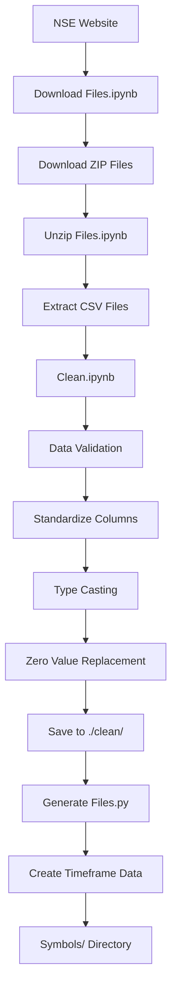
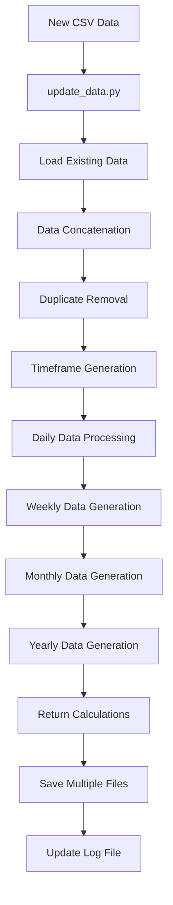
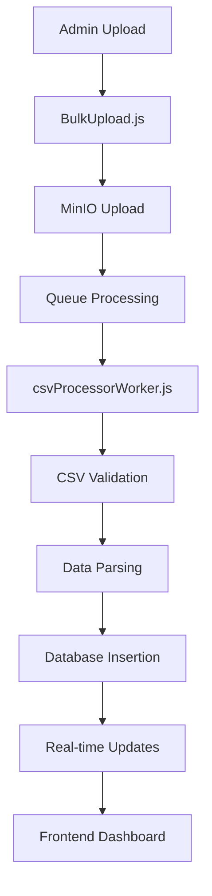

# Workflow Analysis: Old vs New Software

## Overview

This document provides a comprehensive analysis of the data workflows in both the existing Python Dash Plotly application and the new Seasonality-website application, focusing on the key differences in data pipeline management.

## Data Pipeline Comparison

### Old Software Data Pipeline (Python Dash Plotly)

#### 1. **NSE Data Scraping Pipeline**
**Location**: `extras/bhavcopy/`

**Components**:
- **Download Files.ipynb** - Automated NSE data scraping
- **Clean.ipynb** - Data cleaning and validation
- **Unzip Files.ipynb** - File extraction and processing

**Workflow**:

**Key Features**:
- **Automated Scraping**: Downloads daily NSE data via API
- **Date Range Processing**: Handles business days and market holidays
- **File Management**: Organizes data by date and symbol
- **Data Validation**: Ensures data quality and consistency

#### 2. **Data Processing Pipeline**
**Location**: `extras/update_data/`

**Components**:
- **update_data.py** - Main data processing script
- **logFile.csv** - Data tracking and versioning

**Workflow**:

**Key Features**:
- **Incremental Updates**: Only processes new data
- **Multiple Timeframes**: Generates 5 different timeframes
- **Return Calculations**: Calculates points and percentages
- **Data Versioning**: Maintains log of processed data

#### 3. **Timeframe Generation Logic**
**Location**: `extras/update_data/update_data.py`

**Timeframes Generated**:
1. **1_Daily.csv** - Daily market data
2. **2_MondayWeekly.csv** - Monday-based weekly data
3. **3_ExpiryWeekly.csv** - Options expiry-based weekly data
4. **4_Monthly.csv** - Monthly aggregated data
5. **5_Yearly.csv** - Yearly aggregated data

**Key Calculations**:
- Return Points: `Close - Previous Close`
- Return Percentage: `(Return Points / Previous Close) * 100`
- Week Numbers: Monthly and yearly week counting
- Even/Odd indicators for analysis

### New Software Data Pipeline (Seasonality-website)

#### 1. **Admin Upload Pipeline**
**Location**: `seasonality-website/apps/backend/src/routes/uploadRoutes.js`

**Components**:
- **Bulk Upload Interface** - Admin panel for CSV uploads
- **MinIO Storage** - Object storage for uploaded files
- **Background Processing** - BullMQ queue system
- **Database Storage** - PostgreSQL with Prisma ORM

**Workflow**:

**Key Features**:
- **Bulk Upload**: Multiple CSV files at once
- **Real-time Processing**: Background job queue
- **Data Validation**: Automatic error detection
- **Progress Tracking**: Live upload progress
- **Scalable Storage**: MinIO object storage

#### 2. **Database Schema**
**Location**: `seasonality-website/apps/backend/prisma/schema.prisma`

**Tables**:
- **User** - User management and authentication
- **UploadBatch** - Batch upload tracking
- **UploadedFile** - Individual file processing status
- **Ticker** - Market symbol information
- **SeasonalityData** - Processed market data

**Key Features**:
- **Relational Data**: Proper relationships between entities
- **Data Integrity**: Foreign key constraints
- **Audit Trail**: Processing history and status tracking
- **Scalability**: Designed for large datasets

#### 3. **Processing Architecture**
**Location**: `seasonality-website/apps/backend/src/services/`

**Components**:
- **csvService.js** - CSV processing logic
- **uploadService.js** - Upload management
- **csvProcessorWorker.js** - Background processing

**Key Features**:
- **Concurrent Processing**: Multiple files processed simultaneously
- **Error Handling**: Comprehensive error detection and reporting
- **Data Transformation**: CSV to database format conversion
- **Real-time Broadcasting**: Live updates to frontend

## Key Differences Analysis

### 1. **Data Source Management**

**Old Software**:
- ✅ **Automated Scraping**: Direct from NSE
- ✅ **Scheduled Updates**: Daily automated runs
- ❌ **Manual Intervention**: Requires script execution
- ❌ **Error Handling**: Limited error recovery

**New Software**:
- ❌ **No Scraping**: Relies on external team
- ✅ **Admin Upload**: Manual but controlled
- ✅ **Error Handling**: Comprehensive validation
- ✅ **Progress Tracking**: Real-time feedback

### 2. **Data Storage**

**Old Software**:
- ❌ **File-based**: CSV files on local disk
- ❌ **No Relationships**: Flat file structure
- ❌ **Limited Querying**: File system searches
- ❌ **Scalability Issues**: File system limitations

**New Software**:
- ✅ **Database Storage**: PostgreSQL with relationships
- ✅ **Query Optimization**: Indexes and constraints
- ✅ **Scalability**: Designed for growth
- ✅ **Data Integrity**: ACID compliance

### 3. **Processing Architecture**

**Old Software**:
- ❌ **Sequential Processing**: One file at a time
- ❌ **Memory Intensive**: Large file processing
- ❌ **No Concurrency**: Single-threaded
- ❌ **Limited Monitoring**: Basic logging

**New Software**:
- ✅ **Parallel Processing**: Multiple files simultaneously
- ✅ **Memory Efficient**: Streaming processing
- ✅ **Background Jobs**: Non-blocking operations
- ✅ **Real-time Monitoring**: Live progress updates

### 4. **User Interface**

**Old Software**:
- ❌ **Basic Dash**: Simple web interface
- ❌ **Limited Admin**: Basic user management
- ❌ **No Upload**: No data upload capability
- ❌ **Static Interface**: No real-time updates

**New Software**:
- ✅ **Modern UI**: Next.js with responsive design
- ✅ **Admin Panel**: Comprehensive user management
- ✅ **Upload Interface**: Bulk CSV upload capability
- ✅ **Real-time Updates**: Live data and progress

## Migration Strategy

### Phase 1: Data Migration
1. **Extract CSV Data**: From old `Symbols/` directory
2. **Convert to Database**: Use existing processing logic
3. **Validate Data**: Ensure data integrity
4. **Update References**: Migrate data access patterns

### Phase 2: Feature Migration
1. **Analysis Components**: Port Python logic to Node.js
2. **Visualization**: Convert Dash components to React
3. **User Interface**: Modernize admin and user interfaces
4. **Authentication**: Implement JWT-based auth

### Phase 3: Pipeline Integration
1. **Admin Upload**: Replace scraping with upload interface
2. **Processing**: Use new background job system
3. **Monitoring**: Implement real-time dashboards
4. **Backup**: Set up data backup procedures

## Benefits of New Architecture

### 1. **Scalability**
- **Database Growth**: PostgreSQL handles large datasets
- **Concurrent Users**: Support for multiple simultaneous users
- **File Processing**: Handle 300+ CSV files efficiently

### 2. **Maintainability**
- **Code Organization**: Clear separation of concerns
- **Error Handling**: Comprehensive error detection
- **Monitoring**: Real-time system health tracking

### 3. **User Experience**
- **Modern Interface**: Responsive, intuitive design
- **Real-time Updates**: Live progress and data updates
- **Admin Control**: Comprehensive user and data management

### 4. **Data Management**
- **Centralized Storage**: Single source of truth
- **Data Relationships**: Proper relational structure
- **Query Performance**: Optimized database queries

## Conclusion

The migration from the old Python Dash Plotly application to the new Seasonality-website represents a significant architectural improvement. While the old system had automated NSE scraping capabilities, the new system provides better scalability, maintainability, and user experience.

The key trade-off is the removal of automated scraping in favor of admin-controlled uploads, which aligns with your team's workflow where data is cleaned and provided by a separate team. This change simplifies the system while providing better data management and user control.

The new architecture is designed to handle your specific requirements of processing 300+ CSV files daily with real-time updates and comprehensive admin capabilities.